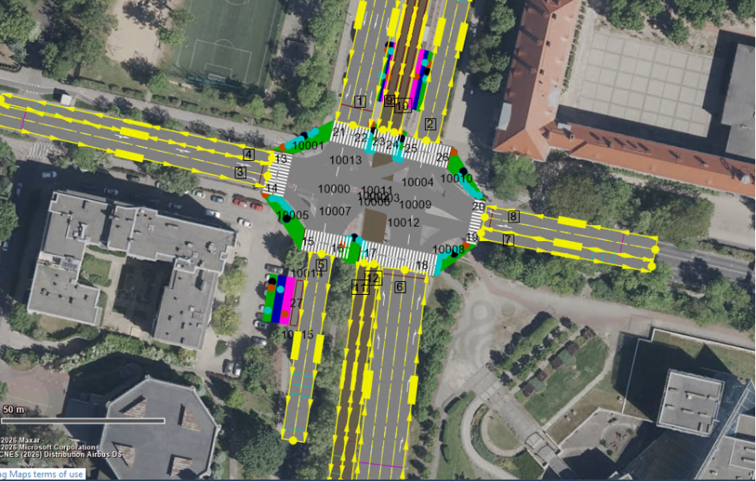
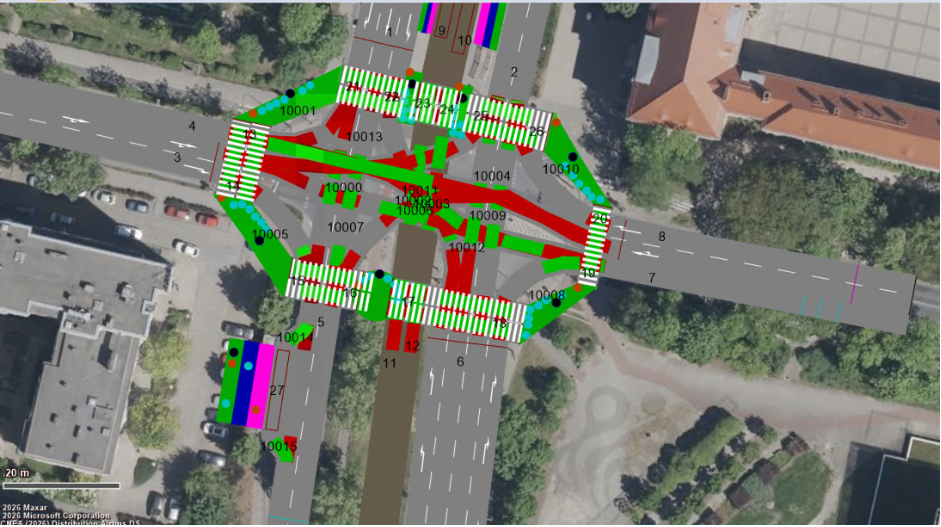

# Traffic Intersection Simulation — Poznań, Poland
### Zbąszyńska × Bukowska | Intersection ID 8 | PTV VISSIM


---

## 📌 Project Overview

This project is a microscopic traffic simulation model of a real signalized intersection in Poznań, Poland — the crossing of **Zbąszyńska** and **Bukowska** streets — built as part of the *Traffic and Transportation Modelling 2026* course at **INSA Hauts-de-France**.

**Coordinates:** `52.409616, 16.888585` — Poznań, Poland  
**Simulation Tool:** PTV VISSIM


## Intersection Analysis


The intersection was carefully analyzed from satellite imagery to extract lane counts, tram track positions, bicycle crossings and signal pole locations.

### Lane Configuration
| Arm | Entering lanes | Exiting lanes |
|---|---|---|
| **North** | 3 car + 1 tram | 2 car + 1 tram |
| **South** | 4 car + 1 tram | 3 car + 1 tram |
| **West** | 2 car | 1 car |
| **East** | 2 car | 2 car |

### Special Features
- Dedicated tram corridor running N-S through center of road
- Red bicycle crossings at all 4 corners
- Pedestrian zebra crossings on all 4 arms
- Asymmetric West arm (2 lanes in, 1 lane out)
- Traffic signal poles at all corners

---

## VISSIM Network Model




### Links Created
- **8 car links** — entering and exiting on all 4 arms
- **2 tram links** — northbound and southbound dedicated tracks
- **14 connectors** — straight, left turn and right turn movements
- **1 tram connector** — straight through the intersection

### Conflict Areas


Priority rules applied at all conflict points:

| Priority level | Vehicle type |
|---|---|
| **Highest** | Tram — always has right of way |
| **Medium** | Straight-going cars |
| **Lower** | Turning cars — must yield to straight |
| **Lowest** | Cyclists and pedestrians |

---

## 📊 Traffic Data & Vehicle Inputs


Original traffic flow data provided for Intersection ID 8.
**10% of all values** used as VISSIM simulation inputs per assignment requirements.

### VISSIM Vehicle Inputs (10% of original data)

| Arm | Cars (veh/h) | Cyclists (veh/h) | Trams (veh/h) |
|---|---|---|---|
| **North** | 1961 | 248 | 6 |
| **South** | 2062 | 0 | 6 |
| **West** | 559 | 0 | — |
| **East** | 781 | 0 | — |

### Vehicle Routing Proportions

| Entry | Straight | Left | Right |
|---|---|---|---|
| **North** | 0.987 | 0.007 | 0.007 |
| **South** | 0.938 | 0.031 | 0.031 |
| **West** | 0.953 | 0.023 | 0.023 |
| **East** | 0.682 | 0.159 | 0.159 |

> Full calculations available in [data/traffic_calculations.md](data/traffic_calculations.md)

---

## 🚦 Signal Program Design

**Cycle time: 90 seconds** — custom designed for best traffic flow

| Phase | Groups | Green start | Green end | Duration | Reason |
|---|---|---|---|---|---|
| **Phase 1 — N-S** | North + South + Tram | 0 | 45 | **45 sec** | Dominant flow — 4023 veh/h combined |
| Amber | All red | 45 | 48 | 3 sec | Safety clearance |
| **Phase 2 — E-W** | East + West | 48 | 73 | **25 sec** | Secondary flow — 1340 veh/h combined |
| Amber | All red | 73 | 76 | 3 sec | Safety clearance |
| **Phase 3 — Peds** | All pedestrian + cyclist crossings | 76 | 87 | **11 sec** | Safe crossing — no vehicles moving |
| Amber | All red | 87 | 90 | 3 sec | Safety clearance |

```
Timeline (90 sec cycle):
SEC:  0              45  48              73  76       87  90
      |— N + S + TRAM —|AR|— E + W ——————|AR|— PEDS ——|AR|
```

### Rationale
- **N-S gets 45 sec (50%)** — highest combined volume, tram shares phase with no conflict
- **E-W gets 25 sec (28%)** — significantly lower volume than N-S
- **Pedestrians get 11 sec (12%)** — dedicated safe phase with zero vehicle movement
- **No overlapping green phases** — eliminates all vehicle conflicts

---

## 🎬 Simulation


---

## 🔧 Methodology

| Step | Action |
|---|---|
| **1. Intersection analysis** | Studied satellite imagery to count lanes, identify tram tracks, crossings and signal positions |
| **2. Network geometry** | Drew all links and connectors in VISSIM on top of satellite background |
| **3. Traffic data input** | Applied 10% rule to original counts, set vehicle compositions and routing decisions |
| **4. Conflict priorities** | Identified all conflict areas and set correct priority rules |
| **5. Signal design** | Designed 3-phase 90-second signal program proportional to traffic volumes |
| **6. Simulation** | Ran simulation and verified correct vehicle behaviour |

---

## 🛠️ Tools

| Tool | Purpose |
|---|---|
| **PTV VISSIM** | Microscopic traffic simulation |
| **Bing Maps** | Satellite imagery for background and lane analysis |
| **Google Maps** | Lane direction verification |
| **ZTM Poznań** | Tram line timetable reference |

---

## 🎓 Academic Context

| | |
|---|---|
| **Course** | Traffic and Transportation Modelling 2026 |
| **University** | INSA Hauts-de-France |
| **Program** | Master 1 — IT for Smart and Sustainable Systems (IT4SSM) |

---

## 👤 Author

**[Your Name]**
- 💼 Data Engineer | Software Engineer
- 🎓 M1 IT4SSM — INSA Hauts-de-France
- 🔗 [LinkedIn](https://linkedin.com)
- 🐙 [GitHub](https://github.com)

---

> *This project applies data analysis and systems modelling skills to real-world transportation engineering — translating raw traffic count data into an accurate, optimized simulation model.*
